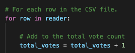
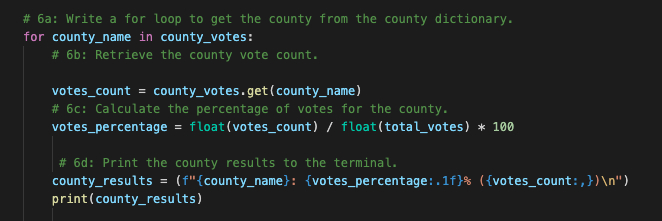
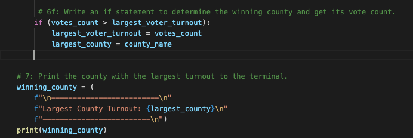
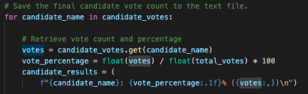
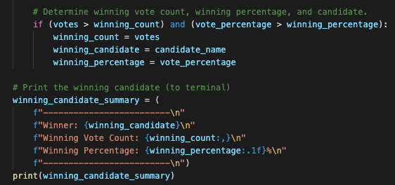

# Election_Analysis
## Overview of Election Audit
### Purpose

The purpose of this project is to help Tom and Seth, Colorado Board of Election employees, with US congress election audit in Colorado using Python. On Module 3, the total number of votes for election, the list of candidates, the total number of votes that each candidate received, the percentage of votes that each candidate received, and the winner of the election were found based on election_results.csv. Now Tom and Seth want additional information for the audit so the voter turnout for each county, the percentage of votes that each county got, and the winning county were found through this project. 

## Election-Audit Results
- The toal number votes that were cast in this congreessional election: 369,711

- The number of votes and the percentage of total votes for each county:
	- Jefferson: 38,855, 10.5%
	- Denver: 306,055, 82.8%
	- Arapahoe: 24,801, 6.7%

- The county that had the largest numbe of votes: Denver

- The number of votes and the percentage of the total votes each candidate received:
	- Charles Casper Stockham: 85,213, 23.0%
	- Diana DeGette: 272,892, 73.8%
	- Raymon Anthony Doane: 11,606, 3.1% 

- The candidate who won the elction, their vote count, and their percentage of the total vote:
	- Diana DeGette 
	- 272,892 votes  
	- 73.8% of the total votes

## Election-Audit Summary
Our current script is based on election_results.csv. In this file, Ballot ID is shown on the 1st column, County on the 2nd column and Candidate name on the 3rd column. Other election reports could show information in different orders. All you need to do is changing the index based on the reports, so you can get the candidate name, county name, and all other information like winning candidate and winning county. Also you can update the code for county to city or state for all other elections.    